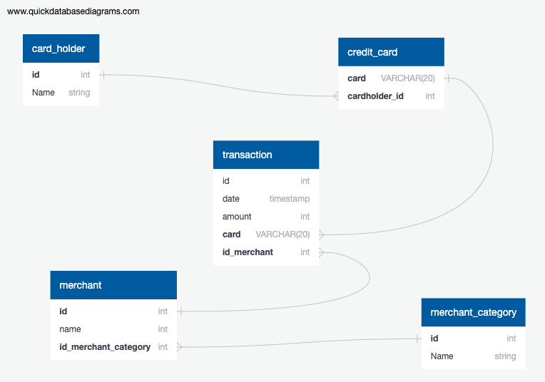

# Credit_Card_Fraud

## Data Modeling

Create an entity relationship diagram (ERD) by inspecting the provided CSV files.



## Part 1:
* Some fraudsters hack a credit card by making several small transactions (generally less than $2.00), which are typically ignored by cardholders. 
  * How can you isolate (or group) the transactions of each cardholder? 
    ```
    SELECT card, sum(amount) as total_spent
    FROM transaction 
    GROUP BY card;
    ```
    * **Output:** [Group cardholder transactions](./output/grouping_cardholders.csv)
  * Count the transactions that are less than $2.00 per cardholder. 
    ```
    SELECT card, COUNT(*) as tx_less_than_2
    FROM transaction
    WHERE amount < 2
    GROUP BY card
    ORDER BY tx_less_than_2 DESC;
    ```
    * **Output:** [Transaction count less than $2](./output/tx_less_than_2.csv)
  * Is there any evidence to suggest that a credit card has been hacked? Explain your rationale.
    * Take your investigation a step futher by considering the time period in which potentially fraudulent transactions are made. 
      ```
      SELECT date, card, COUNT(*) as tx_less_than_2
      FROM transaction
      WHERE amount < 2
      GROUP BY card, date
      ORDER BY tx_less_than_2 DESC;
      ```
      * **Output:** [Small transactions grouped by dat](./output/tx_less_than_2_groupby_date.csv)
  * What are the top 100 highest transactions made between 7:00 am and 9:00 am? 
    ```
    SELECT date, amount
    FROM transaction
    WHERE EXTRACT(HOUR FROM date) BETWEEN '07' AND '08'
    ORDER BY amount DESC
    FETCH FIRST 100 ROWS ONLY;
    ```
      * **Output:** [Top 100 transactions between 7:00am and 9:00am](./output/top_100_highest_tx_7am_to_9am.csv)
      * Do you see any anomalous transactions that could be fraudulent?
      * Is there a higher number of fraudulent transactions made during this time frame versus the rest of the day?
      * If you answered yes to the previous question, explain why you think there might be fraudulent transactions during this time frame.
  * What are the top 5 merchants prone to being hacked using small transactions? 
    ```
    SELECT id_merchant, count(amount) as number_of_small_tx
    FROM transaction
    WHERE amount < 2
    GROUP BY id_merchant
    ORDER BY count(amount) DESC
    LIMIT 5;
    ```
      * **Output:** [Top 5 merchants prone to small transaction hack](./output/top_5_merchants_small_tx_hack.csv)

## Part 2:

Your CFO has also requested detailed trends data on specific card holders. Use the [starter notebook](Starter_Files/challenge.ipynb) to query your database and generate visualizations that supply the requested information as follows, then add your visualizations and observations to your markdown report:      

* The two most important customers of the firm may have been hacked. Verify if there are any fraudulent transactions in their history. For privacy reasons, you only know that their cardholder IDs are 2 and 18.

  * Using hvPlot, create a line plot representing the time series of transactions over the course of the year for each cardholder separately. 
  
  * Next, to better compare their patterns, create a single line plot that contains both card holders' trend data.  

  * What difference do you observe between the consumption patterns? Does the difference suggest a fraudulent transaction? Explain your rationale.

* The CEO of the biggest customer of the firm suspects that someone has used her corporate credit card without authorization in the first quarter of 2018 to pay quite expensive restaurant bills. Again, for privacy reasons, you know only that the cardholder ID in question is 25.

  * Using Plotly Express, create a box plot, representing the expenditure data from January 2018 to June 2018 for cardholder ID 25.
  
  * Are there any outliers for cardholder ID 25? How many outliers are there per month?

  * Do you notice any anomalies? Describe your observations and conclusions.

## Challenge

Another approach to identifying fraudulent transactions is to look for outliers in the data. Standard deviation or quartiles are often used to detect outliers.

Use the [challenge starter notebook](Starter_Files/challenge.ipynb) to code two Python functions:

* One that uses standard deviation to identify anomalies for any cardholder.

* Another that uses interquartile range to identify anomalies for any cardholder.

For help with outliers detection, read the following articles:

* [How to Calculate Outliers](https://www.wikihow.com/Calculate-Outliers)

* [Removing Outliers Using Standard Deviation in Python](https://www.kdnuggets.com/2017/02/removing-outliers-standard-deviation-python.html)

* [How to Use Statistics to Identify Outliers in Data](https://machinelearningmastery.com/how-to-use-statistics-to-identify-outliers-in-data/)

## Submission

Post a link to your GitHub repository in BootCamp Spot. The following should be included your repo:

* An image file of your ERD.

* The `.sql` file of your table schemata.

* The `.sql` file of your queries.

* The Jupyter Notebook containing your visual data analysis.

* A ReadME file containing your markdown report.

* **Optional:** The Jupyter Notebook containing the optional challenge assignment.

## Hint

For comparing time and dates, take a look at the [date/time functions and operators](https://www.postgresql.org/docs/8.0/functions-datetime.html) in the PostgreSQL documentation.

---
## Requirements

## Data Modeling  (20 points)

## To receive all points, your code must:

* Define a database model. (10 points)
* Use the defined model to create a PostgreSQL database. (10 points)

## Data Engineering  (20 points)

## To receive all points, your code must:

* Create a database schema for each table and relationship. (5 points)
* Specify the data types. (5 points)
* Define primary keys. (5 points)
* Define foreign keys. (5 points)

## Data Analysis  (30 points)

## To receive all points, your code must:

* Identify fraudulent transactions. (10 points)
* Utilize SQL and Pandas DataFrames for a report within Jupyter Notebook. (10 points)
* Provide a visual data analysis of fraudulent transactions using Pandas, Plotly Express, hvPlot, and SQLAlchemy to create the visualizations. (10 points)

## Coding Conventions and Formatting (10 points)

## To receive all points, your code must:

* Place imports at the beginning of the file, just after any module comments and docstrings and before module globals and constants. (3 points)
* Name functions and variables with lowercase characters and with words separated by underscores. (2 points)
* Follow Don't Repeat Yourself (DRY) principles by creating maintainable and reusable code. (3 points)
* Use concise logic and creative engineering where possible. (2 points)

## Deployment and Submission (10 points)

## To receive all points, you must:

* Submit a link to a GitHub repository that’s cloned to your local machine and contains your files. (5 points)
* Include appropriate commit messages in your files. (5 points)

## Code Comments (10 points)

## To receive all points, your code must:

* Be well commented with concise, relevant notes that other developers can understand. (10 points)